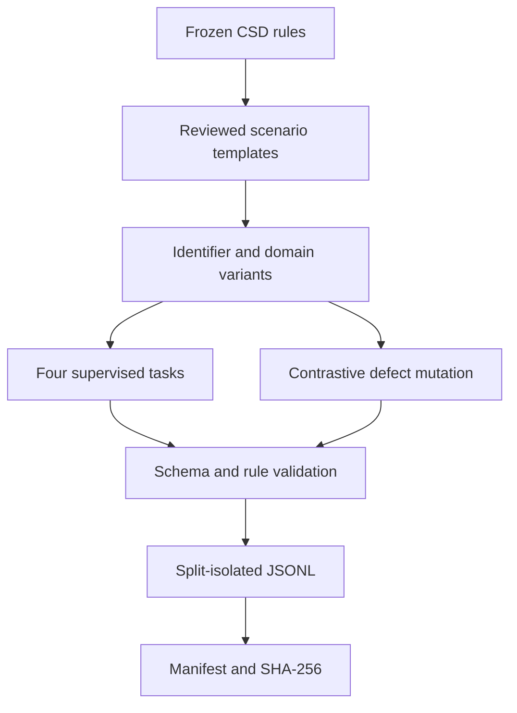

# CSD Reasoning Synthesis Specification v0.1

## 1. Objective

Create training data that teaches an LLM to reason conservatively over changing
evidence:

1. separate evidence, basis, state, verdict, and freshness;
2. retract only claims affected by a declared dependency change;
3. preserve a conclusion when an independent sufficient basis survives;
4. produce `unknown` or `stale` when support is lost;
5. refuse automatic replacement conclusions;
6. require new evidence, a new basis, and sufficient authority for restoration;
7. distinguish internal protocol validity from real-world truth;
8. expose assumptions and audit history explicitly.

CSD is therefore used in two ways:

- as a formal source of reasoning problems; and
- as the control protocol for dataset identity, provenance, invalidation,
  correction, and release.

## 2. Key design decision

The corpus does not train unrestricted prose chain-of-thought. Each target is an
auditable public justification with a fixed semantic skeleton:

```text
Decision
Evidence impact
Basis result
Justification
Rejected inference
Applicable rules
Next governed step
```

This representation is compact enough for supervised training and explicit
enough for deterministic evaluation.

## 3. Source baseline

| Source | Frozen baseline |
|---|---|
| Control-Status Discipline | v0.9.0 Candidate, SHA-256 `b2ae29adb3f2ae275c42a7fdb067cba758b54c606e9e350f6b2e41baee293d4e` |
| Formalization Charter | v0.1.1 Approved, SHA-256 `c59fc9779342c9a16fc8be3b7990f190ee3476eda198a7d7149e27664e6e7df2` |

The seed covers M-01 through M-15 plus governance, liveness, adverse-evidence,
and append-only-history cases.

## 4. Data products

### 4.1 Supervised fine-tuning

Each JSONL row contains:

- immutable example ID and dataset version;
- split and scenario-family identity;
- synthetic flag;
- task type, difficulty, and surface;
- system, user, and assistant messages;
- machine-readable expected decision trace;
- source section, generation method, provider-call count, and frozen source
  hashes.

The four task types are:

| Task | Capability |
|---|---|
| `transition` | Predict evidence, basis, state, and verdict changes |
| `critique` | Detect and repair a rule-violating answer |
| `counterfactual` | Identify the minimum governed restoration condition |
| `audit` | Produce a complete, traceable justification |

### 4.2 Preference pairs

Each preference row contains the same scenario prompt, a CSD-conformant chosen
answer, a plausible defective answer, and the rule-grounded rejection basis.

The rejected examples deliberately exercise:

- promotion from apparently favourable changes;
- whole-record staleness;
- verdict replacement without assessment;
- reuse or reactivation of invalidated identities;
- evidence-only verdict formation;
- pass preservation under an incomplete strengthened profile;
- circular claims that a declared dependency graph proves its own completeness.

## 5. Synthesis method

The v0.1 generator is deterministic and uses zero provider calls.



Surface variation changes identifiers and context labels but not the underlying
transition. This makes the initial corpus reproducible while testing whether a
model can apply the same rule outside a single naming pattern.

## 6. Split policy

The split unit is the underlying source scenario, not the rendered example.
Every task and surface variant derived from one scenario stays in one split.

This prevents transition-level leakage. A random row split would be invalid
because the model could see the same logical state machine in training and test
under different names.

The v0.1 split is:

- train: M-01–M-11, G-01, G-02, and C-01;
- validation: M-12–M-14 and G-04;
- test: M-15, L-01, and H-01.

The test split emphasizes the hardest generalization boundaries: hidden
dependency incompleteness, conditional liveness, and immutable audit history.

## 7. CSD lifecycle for dataset records

Every example has a stable identity. Accepted content is never silently edited.

| Dataset event | CSD treatment |
|---|---|
| New synthetic example | New example identity plus source and generator basis |
| Source rule changes | Invalidate only dependent examples |
| Validator defect | Invalidate outputs whose acceptance basis used that validator |
| Content correction | Issue a new example identity or dataset version |
| Re-verification | New verification evidence and acceptance basis |
| Dataset release | Immutable manifest with exact member hashes |

An old record may remain in history as rejected or superseded, but it must not
be relabeled as though it had always been correct.

## 8. Acceptance gates

The seed may be called structurally valid only if:

1. every JSONL row parses;
2. every ID is unique;
3. every record is explicitly marked synthetic;
4. every target cites known CSD rule identifiers;
5. all required message roles and expected fields exist;
6. no source scenario appears in more than one split;
7. chosen and rejected preference answers differ;
8. record counts and SHA-256 fingerprints match the manifest;
9. a second generation run is byte-identical;
10. an independent reviewer checks semantic correctness before use in a
    production training mixture.

Gate 10 is intentionally not automated. The generator can prove its own
determinism, but it cannot serve as an independent oracle for the correctness of
its templates.

## 9. Training use

For supervised training, ingest the `messages` array and ignore the
machine-readable `expected` object if the trainer requires a standard chat
schema. Retain `expected` for evaluation and error analysis.

For preference optimization, use `prompt_messages`, `chosen`, and `rejected`.

Recommended first experiment:

1. train a small adapter on the training split;
2. select checkpoints using exact decision fields on validation;
3. report test performance separately for M-15, liveness, and history;
4. compare against an untrained or base-model control;
5. add non-CSD reasoning benchmarks to test transfer rather than memorization.

No claim of reasoning improvement should be accepted from training loss alone.

## 10. Evaluation metrics

Use field-level and behavioral metrics:

| Metric | Meaning |
|---|---|
| Final-decision exact match | Correct state or verdict outcome |
| Evidence-impact F1 | Correct affected and unaffected evidence |
| Basis-survival accuracy | Correct conjunctive/disjunctive basis reasoning |
| Rule citation F1 | Correct governing invariants |
| Forbidden-inference rate | Frequency of promotion or replacement during invalidation |
| Restoration-integrity rate | New evidence, new basis, authority, and history all preserved |
| Assumption-boundary accuracy | Distinguishes internal validity from real-world soundness |

The primary metric should be a conjunction over decision correctness,
forbidden-inference absence, and basis validity. Averaging these fields can hide
a dangerous answer that reaches the right label for the wrong reason.

## 11. Scaling beyond v0.1

The next corpus should be generated from executable state transitions rather
than templates alone:

1. sample valid initial states from the TLA+ or conformance model;
2. execute one or more governed transitions;
3. serialize pre-state, event, and post-state;
4. generate deliberate mutations mapped to a designated invariant;
5. verify the expected counterexample mechanically;
6. render multiple natural-language surfaces only after the symbolic label is
   frozen;
7. use independent review for dependency completeness and natural-language
   fidelity.

High-value expansions include multi-event temporal reasoning, alternative basis
graphs, scope and configuration changes, approval separation, explicit failed
reassessment, and M-15-style hidden-oracle cases.

## 12. Claim boundary

This package establishes a reproducible synthetic data construction and a
machine-checkable declared-rule envelope. It does not establish:

- that CSD covers all useful forms of reasoning;
- that the natural-language templates are free of every ambiguity;
- that the declared dependency relation is complete in a real domain;
- that a trained model generalizes beyond these state-transition patterns;
- that better benchmark accuracy produces safer real-world decisions.

Those are separate empirical claims requiring independent evidence.
